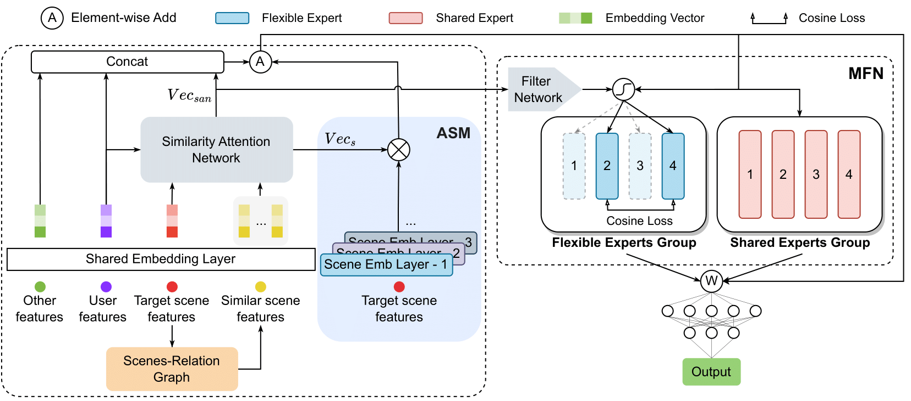
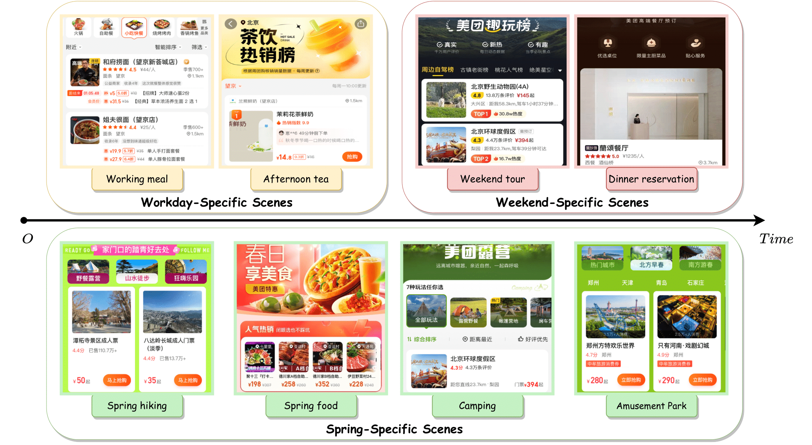

# Scene-wise Adaptive Network for Dynamic Cold-start Scenes Optimization in CTR Prediction

## Model Architecture


## Dynamic Cold-start Scene


## Bibtex:
```sh
@article{li2024scene,
  title={Scene-wise Adaptive Network for Dynamic Cold-start Scenes Optimization in CTR Prediction},
  author={Li, Wenhao and Zhou, Jie and Luo, Chuan and Tang, Chao and Zhang, Kun and Zhao, Shixiong},
  year={2024},
}
```

## Project structure
```
├── config
    ├── SwAN.json
├── data 
    ├── test
        ├── data_2
    ├── train
        ├── data_1
├── model
├── scripts
    ├── SwAN.py
├── utils
    ├── json_reader.py
    ├── model_exporter.py
    ├── schema_utils.py     
├── README.md
```

[//]: # (## Quick start)

[//]: # (### [Ali-CCP: Alibaba Click and Conversion Prediction]&#40;https://tianchi.aliyun.com/dataset/dataDetail?dataId=408&#41;)

[//]: # (```bash)

[//]: # (cd code/aliccp)

[//]: # (sh run.sh)

[//]: # (```)

[//]: # (### Synthetic DataSet )

[//]: # (```bash)

[//]: # (cd code/synthetic_dataset)

[//]: # (sh run.sh)

[//]: # (```)

# Acknowledgement
 - The work is supported by [MeiTuan](https://www.meituan.com).
